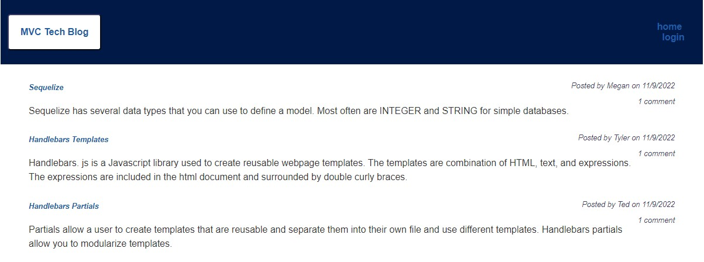

# mvc-tech-blog

## Description

AS A developer who writes about tech I want to create a CMS-style blog site so that I am able to publish articles, blog posts, and my thoughts and opinions. 

## Table of Contents

- [mvc-tech-blog](#mvc-tech-blog)
  - [Description](#description)
  - [Table of Contents](#table-of-contents)
  - [Installation](#installation)
  - [Usage](#usage)
  - [License](#license)

## Installation

This code does not require any installation. You can simply click the URL for the finished product.

## Usage

The following GitHub repo url is:
https://github.com/hoffh-5334/mvc-tech-blog

The deployed url is:

Screenshot of Deployed Application

## License

MIT License